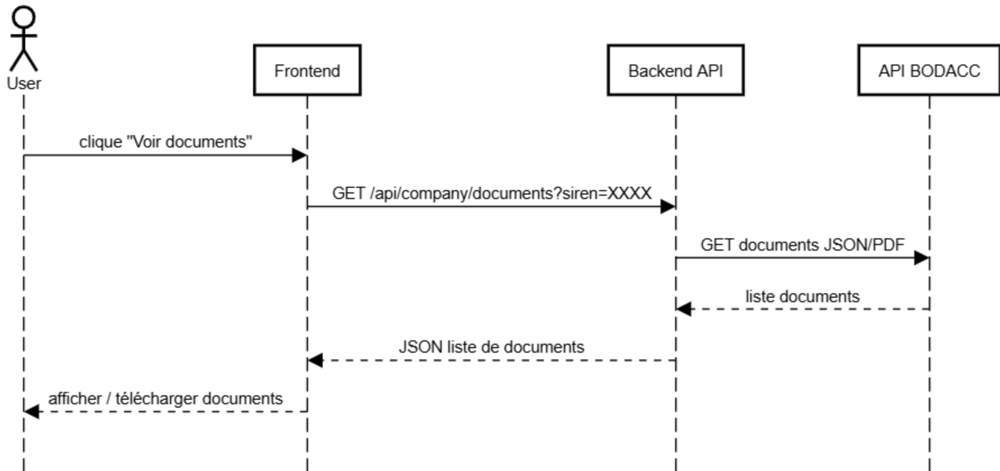
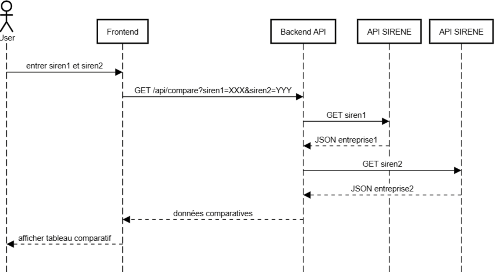

# 0. Define User Stories and Mockups
🎯 User Stories (MoSCoW Method)
Must Have: As a Crédit Agricole agent, I want to search for a company by its name in order to view its official information.

Must Have: As a user, I want to see the legal documents associated with a company in order to verify its status.

Won’t Have: As a user, I do not want to be required to log in to access the data.

### voici La maquette Figma du projet
https://www.figma.com/design/aJd9qZwNbJ8pIDjExuP0z1/Plateforme?node-id=2001-2&t=uMqQiBe2Tn0UWTGB-0

# 1. Design System Architecture
Diagramme d’architecture du système :

# 2. Define Components, Classes, and Database Design
List and define key classes with their attributes and methods

## 3. 🔍 Search for a company by its SIREN number

## 📄 📄 Download BODACC Documents

## 📊 Comparison Between Two Companies

# 4. Document External and Internal APIs

#  5. Plan SCM and QA Strategies
## SCM Strategy

### 1. Version Control System:
Tool: Git
Hosting: GitHub
### 2. Branching Strategy:

Main Branch (main): Production-ready code only
Feature Branches (feature): Created from dev for individual tasks or features.
### 3. Code Management:

Regular Commits: Commit changes frequently with descriptive messages.
Pull Requests (or Merge requests):
Every feature/hotfix branch must be merged through a merger application.
At least one code reviewer must approve before merging.
Code Reviews:
Focus on code quality, performance, readability, and security.
Use templates and checklists to ensure consistency.
## QA Strategy

### 1. Types of Tests:

Unit Tests: For individual functions/components (example with Jest )
Integration Tests: Ensure modules interact correctly (example with Postman)
Manual Testing: For critical paths, exploratory testing, or UI validations.

### 2. Testing Tools:

Jest: For unit testing JavaScript/TypeScript code.
Postman: For API integration testing.
ESLint : For code linting and formatting.

# 6. Technical Justifications
- React : framework moderne pour créer une interface utilisateur 
dynamique.
- Flask : framework léger en Python pour construire des APIs rapidement.
- PostgreSQL : base de données relationnelle robuste.
- API Sirene : source officielle et gratuite d’informations d’entreprise.
